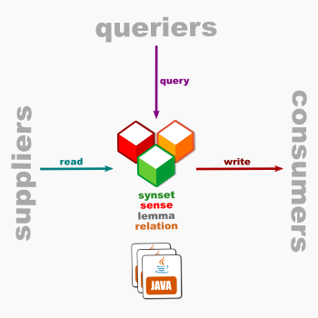

# OEWN model

This library contains the classes that model the objects (lexical entries, senses, synsets, relations, etc...) in a
wordnet.

Project [model](https://github.com/oewntk/model)

## Dataflow

## Maven Central

		<groupId>io.github.oewntk</groupId>
		<artifactId>model</artifactId>
		<version>2.1.2</version>
